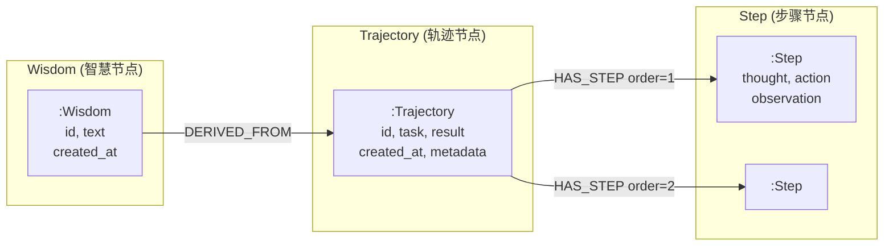

# HCC Memory - Neo4j 图存储设计文档

## 概述

Neo4jBackend 使用图数据库存储 HCC Memory 的 L1 (Trajectories) 和 L2 (Wisdom)。

---

## 图模型设计



---

## 节点定义

### Trajectory 节点
```cypher
(:Trajectory {
    id: "uuid",           # 唯一标识
    task: "任务描述",      # 任务文本
    result: "success",     # success | failure
    created_at: "ISO时间",
    used_wisdom: true,     # 是否使用了 Hot Start
    triggered_system2: false,
    metadata: "{JSON}"     # 扩展元数据
})
```

### Step 节点
```cypher
(:Step {
    thought: "Agent思考过程",
    action: "执行的动作",
    observation: "环境返回",
    metadata: "{JSON}"
})
```

### Wisdom 节点
```cypher
(:Wisdom {
    id: "uuid",
    text: "提炼的智慧文本",
    created_at: "ISO时间",
    metadata: "{JSON}"    # 含 success_rate 等
})
```

---

## 关系定义

| 关系 | 起点 | 终点 | 属性 | 说明 |
|------|------|------|------|------|
| `HAS_STEP` | Trajectory | Step | `order` | 步骤顺序 |
| `DERIVED_FROM` | Wisdom | Trajectory | - | 溯源关系 |

---

## 关键查询

### 1. 按任务检索 Wisdom
```cypher
MATCH (w:Wisdom)
WHERE w.metadata CONTAINS $task
RETURN w.text
LIMIT 3
```

### 2. 溯源查询 (Wisdom → Trajectories)
```cypher
MATCH (w:Wisdom {id: $wisdom_id})-[:DERIVED_FROM]->(t:Trajectory)
RETURN t.id, t.task, t.result
```

### 3. Promotion 检测
```cypher
MATCH (t:Trajectory)
WHERE NOT EXISTS { MATCH (w:Wisdom)-[:DERIVED_FROM]->(t) }
WITH t.task AS task, COLLECT(t) AS trajs
WHERE SIZE(trajs) >= $min_samples
RETURN task, trajs
```

---

## 相比 JSONL 的优势

| 特性 | JSONL | Neo4j |
|------|-------|-------|
| 溯源查询 | O(n) 遍历 | O(1) 图查询 |
| 去重 | 手动实现 | 约束自动保证 |
| 关系管理 | 外键 | 原生关系 |
| 扩展性 | 有限 | 灵活 |

---

## 文件位置

[neo4j_backend.py](file:///Users/richw/ZYAgent/Memory/backends/neo4j_backend.py)

---

## 使用示例

```python
from Memory.backends import Neo4jBackend

# 初始化
backend = Neo4jBackend(
    uri="bolt://localhost:7687",
    user="neo4j",
    password="password"
)

# 存储轨迹
backend.put_samples([trajectory])

# 检索 Wisdom
wisdoms = backend.retrieve(task="如何部署模型?", k=3)

# 溯源
sources = backend.trace_wisdom_sources(wisdom_id="xxx")

# 关闭
backend.close()
```
