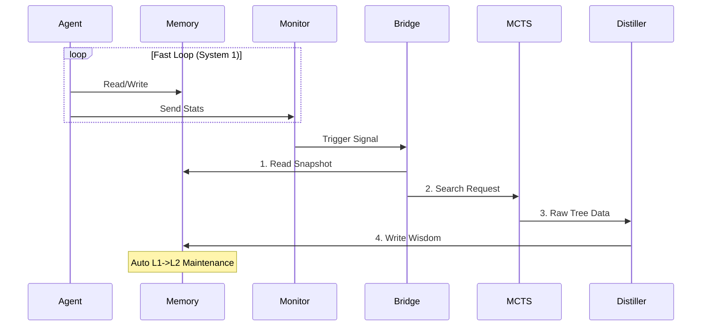
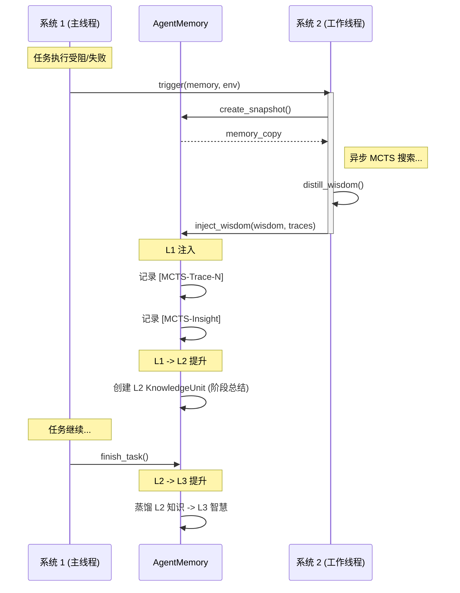

# 工程设计文档: 异步 MCTS-Memory 桥接器 (Async MCTS-Memory Bridge)

| 元数据 (Metadata) | 详细信息 (Details) |
| --- | --- |
| **版本** | 2.0.0 (Release Candidate) |
| **作者** | Antigravity (DeepMind Agentic Team) |
| **状态** | ✅ 已实现并验证 |
| **模块** | `Pipeline.MCTS_Memory` |
| **依赖** | `Memory`, `MCTS` |

---

## 1. 执行摘要 (Executive Summary)

本文档定义了 **Async MCTS-Memory Bridge** 的工程实现规范。该子系统旨在通过引入一个异步的 **系统 2 (慢思考/System 2)** 循环，增强 ReAct Agent 的长时程规划能力。该设计确保在不阻塞主 **系统 1 (快反应/System 1)** 循环的前提下，提供深度的策略指导。

**核心价值**:

* **非阻塞 (Non-blocking)**: MCTS 计算在独立线程运行，保持主 Agent 交互的流畅性。
* **渐进式提升 (Progressive Promotion)**: 智慧通过 L1(痕迹) -> L2(知识) -> L3(智慧) 的自然路径注入，确保并符合 HCC (Hierarchical Cognitive Cache) 的语义一致性。
* **状态隔离 (State Isolation)**: 使用深拷贝快照 (Deep Copy Snapshot) 技术，防止并发读写导致的状态污染。

---

## 2. 系统架构 (System Architecture)

### 2.1 高层组件图 (High-Level Component Diagram)

### 2.2 并发模型 (Concurrency Model)

* **主线程 (Main Thread)**: 负责 Agent 交互、处理环境反馈、运行 Monitor 检查。拥有 `AgentMemory` 的写锁（逻辑上）。
* **工作线程 (Worker Thread)**: 由 `AsyncMCTSBridge` 维护的单守护线程。负责执行昂贵的 MCTS 搜索。
* **数据安全 (Data Safety)**:
* **输入**: 通过 `memory.create_snapshot()` 创建完全隔离的副本传递给工作线程。
* **输出**: 工作线程调用 `memory.inject_wisdom()` 回写主内存。**注意**: 虽然 Python GIL 保证了基本操作的原子性，但在高并发场景下，建议 `inject_wisdom` 内部使用 `threading.Lock` (当前实现依赖于列表追加的原子性)。

---

## 3. 组件规范 (Component Specifications)

### 3.1 健康监控器 (`Pipeline.bridge.Monitor`)

负责实时监控系统 1 的健康状态，决定是否需要系统 2 介入。

* **输入**: `memory_stats` (字典), `recent_events` (字符串列表), `entropy` (浮点数).
* **逻辑**:
1. **高熵值 (High Entropy)**: 模型预测的不确定性 > `0.8`。
2. **连续失败 (Consecutive Failures)**: 最近 `N` (默认=3) 个事件包含 "error/failed" 等关键词。

* **输出**: `Boolean` (触发信号).

### 3.2 异步桥接器 (`Pipeline.bridge.AsyncMCTSBridge`)

调度中心，管理系统 2 的生命周期。

* **队列系统**: 使用 `queue.Queue` 缓冲触发请求。
* **节流 (Throttling)**: 目前每次处理一个任务，后续请求排队。未来可支持 `cancel_pending` (取消挂起任务)。
* **快照机制**: 调用 `AgentMemory.create_snapshot()` 深度复制 HCC 和 Migrator 状态。

### 3.3 智慧蒸馏器 (`Pipeline.bridge.WisdomDistiller`)

将 MCTS 的搜索树转化为人类/LLM 可读的自然语言建议。

* **输入**: MCTS 根节点, 最佳动作 (Best Action).
* **流程**:
1. **提取 (Extract)**: 提取最佳路径 (Best Path), 替代路径, 失败路径 (低 Q 值)。
2. **总结 (Summarize)**:
* **LLM 模式**: 调用 `llm_provider` 生成语义总结。
* **基于规则模式**: 拼接动作序列 (作为回退方案)。

* **输出**: 结构化的智慧字符串 (例如: *"最佳策略: A->B->C. 避免: D."*)。

---

## 4. 数据流: 渐进式智慧注入 (Progressive Wisdom Injection)

系统 2 的输出不再是一个"神谕"直接写入最高层，而是作为一个"经验"流入记忆系统，遵循 HCC 的自然提升法则。

### 4.1 时序图 (Sequence Diagram)

### 4.2 数据制品 (Data Artifacts)

| 层级 | 制品类型 | 内容格式 | 来源 |
| --- | --- | --- | --- |
| **L1** | `Event` | `[MCTS-Trace-1] Path: 1->2 (Q=0.9)` | 原始搜索树 |
| **L2** | `KnowledgeUnit` | `Summary: [MCTS] Strategy: 1->2...` | 蒸馏器输出 |
| **L3** | `WisdomEntry` | `Guidance: For Task X, use Strategy Y` | HCC 任务提升器 (Promoter) |

---

## 5. 接口定义 (API)

### 5.1 `AgentMemory.create_snapshot() -> AgentMemory`

* **深拷贝 (Deep Copy)**: HCC, L1/L2/L3 容器。
* **浅拷贝 (Shallow Copy)**: LLM 提供者, Embedding 提供者 (无状态/共享)。
* **目的**: 防止异步搜索期间的数据污染 (Anti-corruption)。

### 5.2 `AgentMemory.inject_wisdom(wisdom: str, search_traces: List[str], promote_to_l2: bool)`

* **原子操作**:
1. 将 traces 追加到 L1。
2. 将 insight 追加到 L1。
3. (可选) 构建 `KnowledgeUnit` 并追加到 L2。

* **线程安全**: 依赖 GIL 进行列表追加。为了在未来 Python 版本中严格安全，建议添加 `threading.Lock`。

---

## 6. 配置与调优 (Configuration & Tuning)

| 参数 | 默认值 | 描述 | 影响 |
| --- | --- | --- | --- |
| `entropy_threshold` | 0.8 | 触发阈值: Token 熵 | 越低触发越频繁 |
| `consecutive_failure_threshold` | 3 | 触发阈值: 连续错误数 | 抗噪能力 |
| `mcts.max_simulations` | 50 | MCTS 搜索次数 | 思考深度 vs 延迟 |
| `mcts.exploration_constant` | 1.414 | UCT 探索参数 | 广度 vs 深度 |

---

## 7. 运行安全 (Operational Safety)

1. **状态漂移规范 (State Drift Specification)**:
* MCTS 运行时，系统 1 继续运行，导致环境状态改变。
* **缓解措施**: MCTS 输出 **策略 (Wisdom)** 而非具体 **动作 (Action)**。智慧 (例如 "使用二分查找") 对轻微的状态偏移具有鲁棒性。

2. **资源限制 (Resource Limits)**:
* 后台线程限制为 **1** 个，防止 CPU 竞争。
* 队列积压时，MCTS 结果可能过时。建议在生产环境中添加 `TTL (Time-To-Live)` 以丢弃过期任务。

3. **错误处理 (Error Handling)**:
* Monitor 异常 -> 忽略，保持静默 (Silent)。
* MCTS 崩溃 -> 捕获所有异常，记录日志，不影响主线程。
* Distiller 失败 -> 回退到基于规则的总结模式。

---

## 8. 验证 (Verification)

已通过 `Pipeline/test_unit.py` (12 个通过的测试) 验证，覆盖：

* 监控器滞后逻辑 (Hysteresis logic)。
* 异步工作线程生命周期。
* L1 -> L2 提升机制。
* 蒸馏器回退逻辑。

