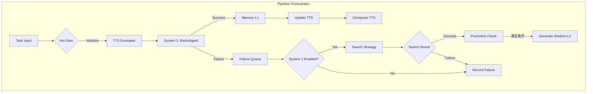

# Pipeline 架构文档

## 系统架构图



---

## 执行流程

### Step 1: Hot Start
```python
wisdom_objs = memory.retrieve(task, k=wisdom_k)  # 从 HCC L2 检索
injected_wisdom = [w.text for w in wisdom_objs]
```
**约束**: 仅在任务开始时执行一次，之后 System 1 禁止主动检索。

---

### Step 2: TTS Examples
```python
tts_examples = tts.retrieve(query=task, k=3)  # 从 TTS 获取 Few-Shot
context.examples = tts_examples
```
**用途**: 为 ReActAgent 提供高质量示例。

---

### Step 3: System 1 执行
```python
self.react_agent = ReActAgent(
    llm_provider=LLMAdapter(self.llm),  # 使用 LLM/llm.py
    max_steps=config.system1.max_steps,
)
result = self.react_agent.run(context)
```

**组件关系**:
| 组件 | 来源 | 说明 |
|------|------|------|
| ReActAgent | [Agent/react_agent.py](file:///Users/richw/ZYAgent/Agent/react_agent.py) | 现有 Agent 框架 |
| LLM | [LLM/llm.py](file:///Users/richw/ZYAgent/LLM/llm.py) | 统一 LLM 接口 |
| LLMAdapter | 内联类 | 适配 LLMProvider 接口 |

---

### Step 4: 成功/失败分支

```python
failure = create_failure_case(trajectory, soft_threshold)
if not failure:
    # Success Path
    memory.put_samples([trajectory])  # L1 存储
    tts.add(tts_trajectory)           # TTS 更新
else:
    # Failure Path
    failure_queue.enqueue(failure)
    # -> 触发 System 2
```

---

### Step 5: System 2 搜索

```python
# 策略选择
if strategy == "mcts":    s2 = MCTSStrategy()
elif strategy == "beam":  s2 = BeamSearchStrategy()
else:                     s2 = NoSearchStrategy()

# 执行搜索
trajectories = s2.search(failure_case, config)
```

**策略对照**:
| 策略 | 文件 | 说明 |
|------|------|------|
| MCTS | [system2/mcts.py](file:///Users/richw/ZYAgent/system2/mcts.py) | 适配现有 MCTS |
| Beam | [system2/beam_search.py](file:///Users/richw/ZYAgent/system2/beam_search.py) | 束搜索 |
| None | [system2/no_search.py](file:///Users/richw/ZYAgent/system2/no_search.py) | 仅反思 |

---

### Step 6: Promotion (L1 → L2)

```python
if memory.enable_promotion:
    new_wisdom = memory.promote(min_samples=5)
    # 使用 LLM 生成 Wisdom 文本
```

---

## 模块依赖关系

```
PipelineOrchestrator
├── LLM (LLM/llm.py)
│   └── LLMAdapter → Agent.LLMProvider
├── TTS (Memory/tts/tts.py)
│   └── TinyTrajectoryStore
├── ReActAgent (Agent/react_agent.py)
├── FailureQueue (内置)
├── Memory Backend
│   ├── JsonlBackend (Memory/backends/jsonl_backend.py)
│   └── Neo4jBackend (Memory/backends/neo4j_backend.py)
└── System 2 Strategy
    ├── MCTSStrategy → MCTS/base.py
    ├── BeamSearchStrategy
    └── NoSearchStrategy
```

---

## 待实现 / 需进一步完善

### 🔴 必须实现

| 项目 | 状态 | 说明 |
|------|------|------|
| [MCTSAdapter](file:///Users/richw/ZYAgent/system2/mcts.py#17-68) LLM 调用 | ⚠️ Mock | [system2/mcts.py](file:///Users/richw/ZYAgent/system2/mcts.py) 中 [get_next_step](file:///Users/richw/ZYAgent/system2/mcts.py#44-47) 等方法需接入真实 LLM |
| [promote()](file:///Users/richw/ZYAgent/memory/backends/neo4j_backend.py#153-225) LLM 摘要 | ⚠️ Mock | [jsonl_backend.py](file:///Users/richw/ZYAgent/memory/backends/jsonl_backend.py) 中 Wisdom 生成需调用 `llm.generate_wisdom()` |
| 等价性验证 | ❌ 未实现 | JsonlBackend vs Neo4jBackend 输出一致性测试 |

### 🟡 建议优化

| 项目 | 说明 |
|------|------|
| [_agent_result_to_trajectory](file:///Users/richw/ZYAgent/pipeline/orchestrator_new.py#319-362) | 应解析 Agent 内部状态获取详细 Steps |
| TTS 持久化 | 当前 TTS 仅在内存中，应支持落盘 |
| 学习曲线 | 实现 `evaluation/` 模块绘制曲线 |

### 🟢 已验证完成

- [x] LLM 集成 ([create_llm](file:///Users/richw/ZYAgent/LLM/llm.py#289-318))
- [x] TTS 工作记忆 ([TinyTrajectoryStore](file:///Users/richw/ZYAgent/Memory/tts/tts.py#264-642))
- [x] Hot Start 注入
- [x] Markov 压缩 (`llm.compress_trajectory`)
- [x] 双后端支持 (JSONL + Neo4j)
- [x] 所有消融开关

---

## 配置映射

```yaml
# config/defaults.yaml
system1:
  max_steps: 10        # ReActAgent 最大步数
  use_wisdom: true     # 是否使用 Hot Start
  wisdom_k: 3          # 注入 Wisdom 数量
  markov_window: 3     # TTS 压缩窗口 (-1=全历史)

system2:
  enabled: true
  search_strategy: mcts  # mcts | beam | none
  
memory:
  enabled: true
  backend: jsonl         # jsonl | neo4j
  enable_hot_start: true
  enable_promotion: true
```
